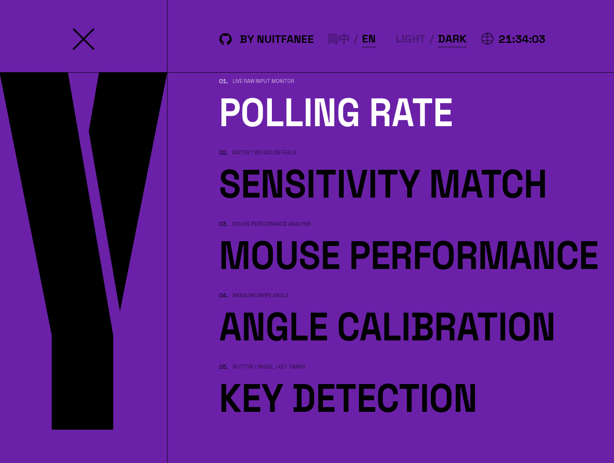
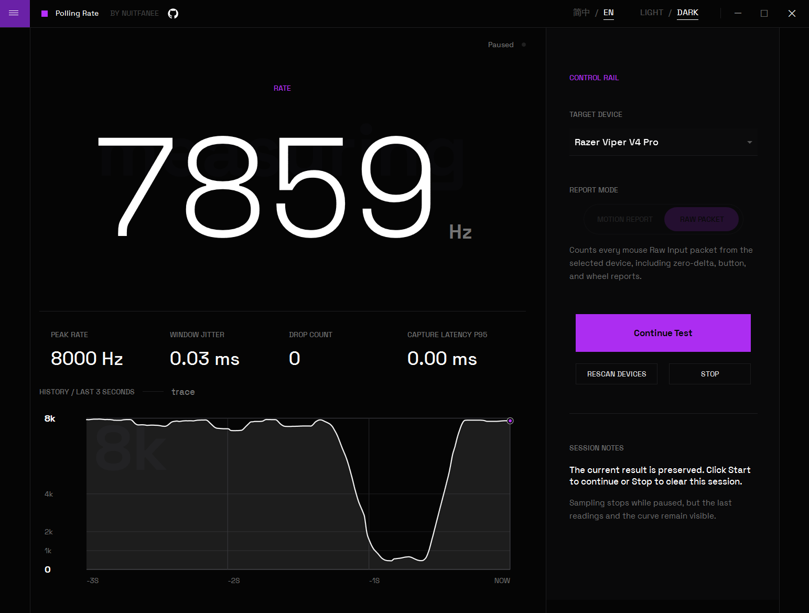
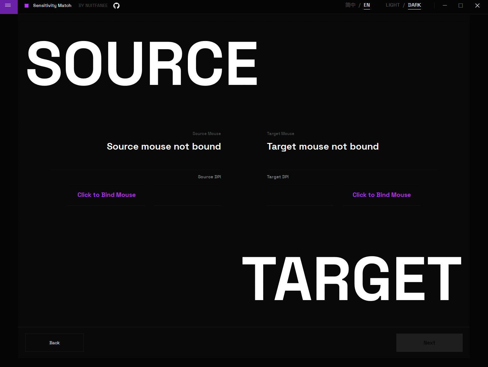
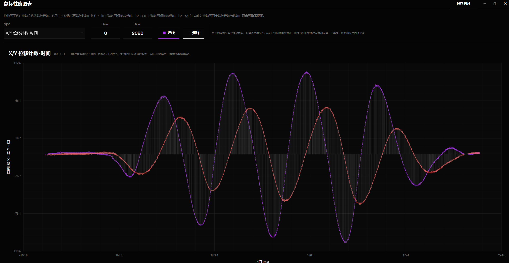

# ClickSyncMouseTester

ClickSyncMouseTester is a Windows desktop tool for mouse input testing, Raw Input inspection, motion analysis, and calibration assistance.

It is currently a C# WPF application targeting `net10.0-windows`. The app observes what a normal Windows user-mode application receives through Raw Input, then exposes that data through focused testing pages and a GPU-backed chart window.

蓝奏云下载地址：
https://wwbwg.lanzouv.com/b0syqhnze  密码:1234

## Documentation

- [English User Manual](docs/ClickSyncMouseTester_User_Manual_EN.md)
- [中文使用说明书](docs/ClickSyncMouseTester使用说明书.md)

## Features

- **Report Rate Test**: live Raw Input report-rate measurement with short-window rate, peak rate, interval jitter, zero-packet ratio, and capture-drop count.
- **Button Double-Click Test**: mouse button, wheel, and custom-key timing inspection with configurable double-click thresholds.
- **Mouse Performance Analysis**: locked single-device Raw Input capture with live summaries, JSON import/export, comparison sessions, and a separate chart window.
- **Sensitivity Matching**: two-mouse measurement workflow that recommends a target DPI and multiplier from three synchronized Raw Input rounds.
- **Sensor Angle Calibration**: horizontal swipe capture that recommends a sensor-angle correction and reports trajectory quality.
- **Theme and localization**: Chinese/English UI text plus light/dark themes.

## UI Preview

### Navigation



### Report Rate



### Sensitivity Matching



### Performance Chart



## Technology

- C#
- WPF
- .NET 10 for Windows
- Windows Raw Input
- Direct3D 11 chart rendering through `ClickSyncMouseTester.ChartGpu`
- Manual regression-test executable under `tests/ClickSyncMouseTester.Tests`

## Repository Layout

```text
.
|-- src/
|   |-- ClickSyncMouseTester/            WPF desktop application
|   `-- ClickSyncMouseTester.ChartGpu/   GPU chart renderer library
|-- tests/
|   `-- ClickSyncMouseTester.Tests/      Regression-test executable
|-- docs/                                User manuals
|-- images/                              README screenshots
|-- artifacts/                           Local build/package artifacts
|-- ClickSyncMouseTester.slnx            Solution file
`-- Directory.Build.props                Shared .NET build settings
```

Main application folders:

- `Assets/`: icons and bundled fonts.
- `Controls/`: custom WPF controls and high-frequency drawing surfaces.
- `Models/`: snapshots, enums, event objects, and domain data.
- `Services/`: Raw Input integration, capture services, analysis engines, localization, themes, export/import, and chart data preparation.
- `ViewModels/`: shell and page view models.
- `Views/`: WPF windows and pages.
- `Resources/`: localization dictionaries, themes, styles, typography, layout tokens, and motion tokens.
- `Navigation/`: page keys, descriptors, and capture-page contracts.
- `Infrastructure/`: MVVM helpers such as bindable base classes and commands.

## Build

Requirements:

- Windows 10 or Windows 11
- .NET 10 SDK
- A Windows environment capable of building WPF projects

Build the solution:

```powershell
dotnet build .\ClickSyncMouseTester.slnx -c Debug
```

Build the main application only:

```powershell
dotnet build .\src\ClickSyncMouseTester\ClickSyncMouseTester.csproj -c Debug
```

Run the application from source:

```powershell
dotnet run --project .\src\ClickSyncMouseTester\ClickSyncMouseTester.csproj -c Debug
```

Run the regression-test executable:

```powershell
dotnet run --project .\tests\ClickSyncMouseTester.Tests\ClickSyncMouseTester.Tests.csproj -c Debug
```

## Architecture Overview

At runtime, the app is organized around a single shell window and several independent page view models:

```text
Application
  -> MainWindow
    -> ShellViewModel
      -> AppPageDescriptor[]
      -> CurrentPage
      -> RawInputBroker
        -> CaptureService
          -> Engine / Analysis service
```

The main app owns the UI shell, page navigation, localization, theme switching, and Raw Input routing. Each feature page keeps its capture logic behind a service and its calculations inside a focused engine or analysis module.

The GPU chart renderer is split into `ClickSyncMouseTester.ChartGpu` so chart rendering code can evolve separately from the WPF page and view-model layer.

## Notes

- The tool reports what Windows Raw Input delivers to a user-mode application. It is not a USB hardware analyzer.
- High report rates can expose system scheduling or queue pressure. Watch dropped-packet and quality indicators when interpreting results.
- Mouse DPI is never changed by the app. DPI fields are inputs for measurement and conversion only.

## License

No license file is currently included in this repository. Confirm licensing before redistributing source or binaries.
